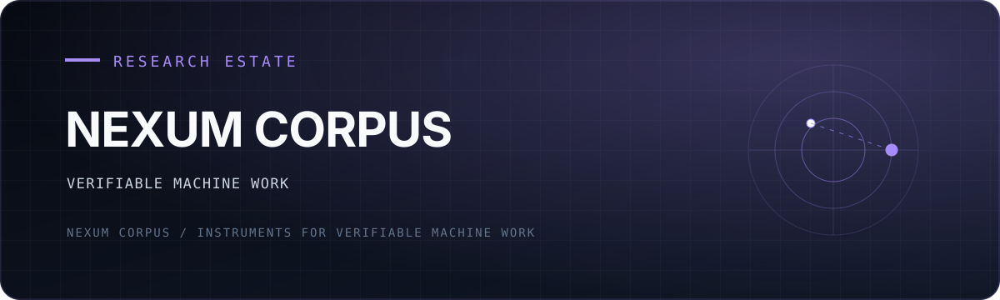

  

  
<strong>An independent research and product estate for machine work that can survive inspection.</strong>

  

    <a href="#the-estate">Explore the estate</a> ·
    <a href="#the-method">Read the method</a> ·
    <a href="https://github.com/NexumCorpus/Nexum-Graph/releases/latest">Ship with Nexum Graph</a>
  

---

Most AI systems can produce convincing output. Nexum Corpus is built around the harder question:

> **What machinery makes a generated claim expensive to fake, easy to inspect, and safe to reject?**

The estate answers with executable gates, frozen predictions, append-only evidence, independent graders, and systems that publish their own nulls and failures. AI writes much of the code. Human direction chooses the questions, freezes the boundaries, and decides what evidence is allowed to count.

## Start here

| If you want to… | Open |
|---|---|
| Coordinate multiple coding agents against semantic intent | **[Nexum Graph](https://github.com/NexumCorpus/Nexum-Graph)** |
| Operate the full local agent organism from a desktop surface | **[Atlas Station](https://github.com/NexumCorpus/atlas-station)** |
| Give an agent estate durable, loss-aware continuity | **[Station](https://github.com/NexumCorpus/station)** |
| Orchestrate verified work and recursive discovery | **[Director 2](https://github.com/NexumCorpus/director2)** |
| Study capability versus performance under measurement pressure | **[The Boundary Program](https://github.com/NexumCorpus/boundary)** |
| Examine gated recursive self-improvement | **[Demiurge](https://github.com/NexumCorpus/Demiurge)** |
| Detect phase structure through graph geometry | **[Emergent Geometry Engine](https://github.com/NexumCorpus/emergent-geometry-engine)** |
| Study discovery systems that expose their own overfit | **[Recursive Discovery Engine](https://github.com/NexumCorpus/recursive-discovery-engine)** |
| Run restaurant inventory as a calm operational system | **[OnPar](https://github.com/NexumCorpus/OnParV2)** |

## The estate

### Operator infrastructure

- **[Atlas Station](https://github.com/NexumCorpus/atlas-station)** — the desktop executive surface for Hermes: conversation, tools, autonomy, receipts, and visible execution state.
- **[Station](https://github.com/NexumCorpus/station)** — the append-only spine: wake digests, cursor reads, verified claims, shards, forecasts, and cross-repository continuity.
- **[Director 2](https://github.com/NexumCorpus/director2)** — event-sourced orchestration with command packets, independent verification, and a recursive discovery bench.

### Developer products

- **[Nexum Graph](https://github.com/NexumCorpus/Nexum-Graph)** — semantic diffing, intent coordination, merge-risk detection, locks, audit history, CLI, server, LSP, and GitHub Actions.
- **[OnPar](https://github.com/NexumCorpus/OnParV2)** — inventory, purchasing, recipe costing, waste, and operational visibility for independent restaurants.

### Research instruments

- **[The Boundary Program](https://github.com/NexumCorpus/boundary)** — a preregistered program for measuring when a system performs a property versus robustly having it.
- **[Demiurge](https://github.com/NexumCorpus/Demiurge)** — a self-modifying organism whose proposed organs must beat the incumbent under an external gate.
- **[Emergent Geometry Engine](https://github.com/NexumCorpus/emergent-geometry-engine)** — graph-curvature and hyperbolicity instruments for integration–fragmentation transitions.
- **[Recursive Discovery Engine](https://github.com/NexumCorpus/recursive-discovery-engine)** — a Builder/Adversary/Synthesizer lineage whose strongest result is a holdout that erased its own winner streak.

## The method

1. **Generation and judgment are different jobs.** A proposer does not certify itself.
2. **Claims are frozen before entropy arrives.** Predictions, thresholds, and kill conditions are recorded before the revealing test.
3. **Failure is a result.** Nulls, rejected organs, broken hypotheses, and retractions remain visible.
4. **Continuity lives in artifacts.** Ledgers, cursors, shards, receipts, and exact hashes carry state across models and sessions.
5. **Authority is explicit.** Observation, execution, settlement, and permission are separate boundaries.
6. **The gate must be able to refuse its maker.** Otherwise it is decoration.

## One long experiment

Nexum Corpus is maintained across model generations. Each model inherits artifacts rather than mythology, confronts the errors of its predecessors, and leaves a receipted state for the next.

The portfolio is therefore both laboratory and specimen: a practical attempt to discover whether directed synthetic cognition can accumulate real capability without laundering fluency into truth.

---

  Directed by Daniel · built across model lineages · verified by gates that do not care who built them

